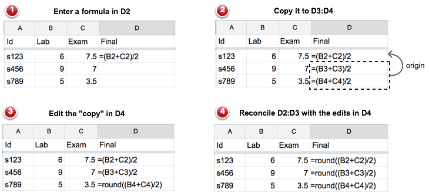

---
title: | 
  Copy-Paste Tracking: Fixing Spreadsheets Without Breaking Them
author:
  - name: Felienne Hermans
    affiliation: Delft University of Technology
    email: f.f.j.hermans@tudelft.nl
  - name: Tijs van der Storm
    affiliation: Centrum Wiskunde & Informatica
    email: storm@cwi.nl
abstract: |
  Spreadsheets are the most popular live programming environments, but they are also notoriously fault-prone.
  One reason for this is that users actively rely on copy-paste to  make up for the lack of abstraction mechanisms.
  Adding abstraction however, introduces indirection and thus cognitive distance. In this paper we propose an alternative: copy-paste tracking. Tracking copies that spreadsheet users make, allows them to directly edit copy-pasted formulas, but instead of changing only a single instance, the changes will be propagated to all formulas copied from the same source. As a result, spreadsheet users will enjoy the benefits of abstraction without its drawbacks.
  
fontsize: 11pt
geometry: margin=2cm
fontfamily: libertine
fontfamily: inconsolata
mainfont: Linux Libertine O
monofont: Inconsolata
bibliography: references.bib
...

# Introduction

<!--
XanaSheet: Fixing Spreadsheets without Breaking Them
Copy-Paste Tracking in Spreadsheets: Supporting Reuse without Compromising Directness
Copy-Paste Tracking in Spreadsheets: Single Point of Change without Abstraction
Copy-Paste Tracking in Spreadsheets: Once and Only Once without Abstraction
E Pluribus Unum: Direct Manipulation of Implicit Abstractions through Copy-Paste Tracking.
One clone to rule them all.
E Pluribus Unum: Many-to-One Direct Manipulation in Spreadsheets
E Pluribus Unum: Direct Manipulation of Implicit Abstractions through Copy-Paste Tracking in Spreadsheets
  Copy-Paste Tracking in Spreadsheets: Single Point of Change without Compromising Direct Manipulation 
  Live Copy-Paste in Spreadsheets
  Turning duplication into an asset
  Emergen Abstraction
  Two flies with one stone: abstraction and directness in spreadsheets
  -->
 

Spreadsheet systems can easily be considered the most successful form of programming. Winston [@Wins2001] estimates that 90% of all analysts in industry perform calculations in spreadsheets. Spreadsheet users perform a range of diverse tasks with spreadsheets, from inventory administration to educational applications and from scientific modeling to financial systems. The financial business is a domain where spreadsheets are especially prevailing. Panko [@Pank2006] estimates that 95% of U.S. firms, and 80% in Europe, use spreadsheets in some form for financial reporting.

<!--
Spreadsheets are formally defined as a collection of worksheets, which in turn can contain cells. These cells can contain values, like numbers or text, or formulas, with calculations and cell references. In addition to these basic operations, many spreadsheet systems also allow users to create charts, graphs and pivot tables. When a user enters or updates a formula, the result is immediately shown to the user. Also, all cells depending on the changed formula are updated immediately. 
-->

Researchers have  argued that the _liveness_ characteristics of spreadsheets have contributed to the widespread success of spreadsheets [@thesisFelienne] and we know from interviews with users that liveness is important to them. They often start building a spreadsheet with the end goal in mind, and manipulate the formulas until they obtain the result they want.

The liveness characteristics of spreadsheets can be divided in two categories:

- Direct manipulation: instead of editing a separate plan or program to achieve some result, the spreadsheet user edits the "thing itself": there is almost no distinction between the actual data and the "code" of a spreadsheet. This feature addresses the "gulf of execution" which exists between the user's goal, and the steps that are required to achieve that goal [@norman1986cognitive].

- Immediate feedback: after a change to the spreadsheet data or formulas, the user can immediately observe the effect of the edit. This feature bridges the "gulf of evaluation" which exists between performing an action and receiving feedback on the success of that action [@norman1986cognitive].

<!--
Problem: spreadsheets are notoriously error-prone (fault-prone?) \cite{.....}
Reason (?): copy-paste is the only mechanism for reuse/sharing behavior/functionality
-->

Despite these attractive features for end-users, spreadsheets are well-known to be extremely fault-prone [@Pank2006]. There are numerous _horror stories_ known in which organizations lost money or credibility because of spreadsheet mistakes. TransAlta for example lost US $24 Million in 2003 because of a copy-paste error in a spreadsheet [@Tran2003]. More recently, the Federal Reserve made a copy-paste error in their consumer credit statement which, although they did not make an official statement about the impact, could have led to a difference of US $4 billion [@Fede2010]. These stories, while single instances of copy-paste problems in spreadsheets do, give credibility to the hypothesis  that copy-paste errors in spreadsheets can greatly impact spreadsheet quality. 

This copy-pasting as in the stories above is not always done by mistake. Rather, we see spreadsheet users using copy-pasting as a deliberate technique. This is understandable, as standard spreadsheets do not support any form of data schema or meta model, so there is no way in which a new worksheet in a spreadsheet could inherit or reuse the model of an existing worksheet. Copy-paste is then often used to compensate for for the lack of code abstractions [@Herm2013]. Finally, when faced with spreadsheets they do not know, users are often afraid to modify existing formulas, thus copy-paste them and add new functionality [@Herm2013] creating many versions of similar formulas, of which the origin can no longer be determined.

<!-- should emphasize the copying here... --->

Existing research improving spreadsheets has focused on extending spreadsheets with abstraction mechanisms. An example of this is the work of Engels _et al._ , who have developed a system called ClassSheets [@Enge2005] with which the structure of a spreadsheet can be described separately. The actual spreadsheet can then be guaranteed to conform to the meta description. Another direction is enriching spreadsheets with user-defined functions (UDFs) [@Jone2003]. In this case, spreadsheets users can factor out common computations into separate cells, and refer to them from elsewhere in the spreadsheet. <!-- TODO: MDSheet -->

Although these features improve the reliability of spreadsheet use, they have one important drawback, namely, that they break the "direct manipulation" aspect of spreadsheets. In a sense, separate meta models, or user defined abstractions, create distance between the actual user's artifact (data + formulas), and its computational behavior. Instead of just looking at the cells, the user now has to inspect at least two places: the cells containing the data and the separate definitions of the abstractions (meta model or user defined functions). 

In this paper we propose XanaSheet, a spreadsheet system that features an alternative method to manage abstraction, without diminishing directness. XanaSheet employs _origin tracking techniques_  to maintain a live connection between source and destination of copy-paste actions. Whenever a copied formula is edited, the modifications are transformed and replayed on the original and all other copies. 
Instead of introducing another level of indirection using abstraction, XanaSheet allows users to edit classes of formulas, all at once. 
In a sense, the abstraction, or user defined function, is there, but it never becomes explicit. By retaining ease of use, this technique has the potential to eliminate a large class of copy-paste errors, without compromising the direct manipulation aspect that make spreadsheets so attractive.

# Copy-Paste Tracking in Action

Figure 1 shows an example user interaction with a spreadsheet containing student grades.
In the first step  the sheet contains just the Lab and Exam grades of three students, and a formula for computing the average of the two grades in D2.
In the second step, the formula in cell D2 is copied to D3 and D4.
D3 and D4 are clones of D2, and this relation is maintained by the system as an origin relation (visualized using the arrow). 
In the third step, the clone in D4 is modified to apply rounding to the computed average. 
Unlike in normal spreadsheets, however, this is not the end of the story
and XanaSheet will reconcile the  original formula of D2 and the other clone in D3 with the changes in D4. 

A way to understand what is happening here, is to see spreadsheet formulas as materialized or unfolded abstractions.
The abstraction in Fig. 1  is function `average(x,y)` for computing the average of two grades. 
In ordinary programming such a function could, for instance, be mapped over a list of pairs of grades to obtain a list of averages, like `map(average, zip(Lab, Exam))`.
In the spreadsheet of Fig. 1, however, the abstraction `average` does not really exist, but is represented collectively by the set of all its inlined applications, e.g. `[(Lab[0]+Exam[0])/ 2, (Lab[1]+Exam[1])/2, (Lab[2]+Exam[2])/2]`.
In a  sense, each application is a clone of the same implicit prototype, with parameters filled in with concrete data references.
The tracking relation induced by copy-paste actions, identifies which clones belong to the same equivalence class.
Therefore, editing one clone triggers updating the clones which belong to  the same  class.

In some cases it might actually not be desired to maintain the origin links between source and destination of copy-paste actions. XanaSheet supports these situations by providing a special "Paste and Detach" action which severs the copy from its original (similar to "Past and Match Style" common in many text editing systems).
The example also assumes that when a user edits a formula she always intends to edit the whole class of clones. However, the system allows the user to edit only this copy, or all copies at once (similar to changing "Recurring events" in calendar applications).

<!-- 
What the default behavior of editing and copying should be, remains a question for further research.
-->

# Semantics of Copy-Paste Tracking

The previous section introduced copy-paste tracking from the perspective of the user. In this section we describe our considerations regarding the implementation. We have implemented an executable semantics of copy-paste tracking for simulating interactive editing sessions with a spreadsheet. The code can be found online here: 
[https://github.com/Felienne/LiveSpreadsheets/tree/master/XanaSheet](https://github.com/Felienne/LiveSpreadsheets/tree/master/XanaSheet).
We are currently working on an interactive prototype of XanaSheet. 

A spreadsheet is a rectangular grid of cells where each cell is identified by its *address*, which are pairs $An$ consisting of a column letter $A$ and a row index $n$.
User actions always operate on one of more of these addresses.
The origin relation between cells is then modeled as a binary relation between such addresses. For instance, the relation 
$Org = \{\langle D3, D2\rangle,\langle D4, D2\rangle\}$ captures the origin relation visualized in Figure 1 (2). 
In this case, the relation states that the formulas in cell $D3$ and cell $D4$ are copied from cell $D2$.

Without loss of generality we assume users only use relative cell referencing in formulas. That is, a cell reference consists of relative row and column offsets starting from the current cell [@Sestoft].
For instance, the reference to `B2` in Fig. 1 (1) is a relative cell reference, is represented as `C-2R0` ("two columns left, same row").
Relative cell referencing allows formulas to be moved around across the grid without having to adjust explicit column names or row indices.

Interacting with the spreadsheet not only updates the sheet itself, but also maintains the origin relation. We describe the effect of the most relevant edit operations on a cell $c$:

- *Entering a formula*: 
If $c$ does not  participate in any origin relation, it is is simply updated with the new formula, and the origin relation is updated with $\langle c, c\rangle$ to model the fact that a new formula is its own origin.
As a result, the origin relation is always reflexively closed.
Otherwise, $c$ has an origin, say $c'$, and the cells that need to be updated are $\{ c'' \;|\; \langle c'', c'\rangle \in Org \}$.
By definition, this includes cell $c$, and, by reflexivity of $Org$, the source cell $c'$ as well. .

- *Copying cell $c$ to $c'$*: The contents of $c$ is copied to $c'$. 
If the contents is a formula,  the origin relation needs to be updated as well.
First, if $c'$ has an existing origin, the corresponding pair is removed from the relation. 
Then the relation is extended based on the current copy operation: if $c$ has an origin $c''$, add  $\langle c', c''\rangle$, else add $\langle c', c\rangle$.
The check for the origin of $c$ ensures that the origin relation is always transitively closed.

- *Inserting/removing a row or column*: after updating the sheet, the origin relation is adjusted so that cell addresses refer to their new locations. 
For instance, when inserting a row  at position $i$, the row components of all the cell addresses on rows $\geq i$ in the origin relation needs to be shifted one down.
In the case of removal, all pairs in the origin relation that contain coordinates on the removed row or column are removed.

- *Entering data*: cell $c$ is updated with the new data. All pairs containing $c$, either as source or target, are removed from the origin relation.

Note that copying a cell $c$ to $c'$ removes the origin entries of $c'$ (if any).
An alternative design could interpret copying a formula as a modification of the destination cell, and thus update all cells in the class of $c'$. In that case all such cells would get $c$ as their new origin.

Although in this section we have just discussed copy-paste tracking for formulas, the same model can be applied equally well to copy-pasting of data. In that case, the origin relation helps against inadvertently duplicating input data.
An interesting special case is the "paste as value" operation. 
Instead of copying a formula, this operation copies the computed value, thus completely disconnecting the destination cell from its source.
Tracking such copy-paste actions would probably not be very useful: editing the pasted value would incur computing the inverse of the original formula, and updating the input data accordingly! 

<!--
In fact, this brings us right into the realm of bidirectional transformation and contraint maintenance [@Meertens] [@Lenses].
-->

<!--
[^1]: The semantics is developed in Rascal [@Rascal] and can be found online here: [https://github.com/Felienne/LiveSpreadsheets/tree/master/XanaSheet](https://github.com/Felienne/LiveSpreadsheets/tree/master/XanaSheet)
-->

[^2]: Note that we don't count the header row as an actual row in this formalization.

[^3]: 

<!--
# Discussion
Changes user interaction
"Past and match style" "Delete only this event, or all future events?"
-->

# Related Work

Copy-paste tracking is a simple technique that is inspired by similar concepts in domains as diverse as term rewriting, hypertext, clone detection, prototypical inheritance , and view maintenance. Below we briefly summarize representative related work in those areas.

*Origin tracking*: Copy-paste tracking is directly inspired by *origin tracking* [@VanDeursenKT93].
In general, origin tracking tries establish a relation between the input and output of some computational process, such as a compiler, or program transformation. Origin tracking, however, has numerous other applications in visualization, debugging, and traceability. 
An application most similar to our work is presented in [@InostrozaVdSE], where origin tracking is used to implement editable regions on generated code. 

*Transclusion*:  Ted Nelson's concept of _transclusion_ [@Nelson65] is a form of "reference by inclusion" where transcluded data is presented through a "live" view: whenever the transcluded content is updated, the views are updated as well.
Our origin relation provides a similar hyper-linking between cells. 
But unlike in the case of transclusion, the relation is bidirectional: changes to the original are propagated forward, but changes to copies (references) are also propagated backwards (and then forwards again). 

*Clone tracking* in software: Godfrey and Tu [@Godf2002] proposed a method called _origin analysis_ which is a related to both clone detection and the above described origin tracking, but aims at deciding if a program entity was newly introduced or whether it if it should more accurately be viewed as a renamed, moved, or otherwise changed version of an previously existing entity. This laid the ground for a tool called _CloneTracker_ that "can automatically track clones as the code evolves, notify developers of modifications to clone
regions, and support simultaneous editing of clone regions." [@Dual2007].

*Prototype-based inheritance*: Lieberman introduced prototypes to implement shared behavior in object-oriented programming [@LiebermanProto]. In prototype-based languages, objects are created by cloning and existing object. The cloned object then inherits features (methods, slots) from its prototype. The parent relation between objects is similar to our origin relation. However, we are not aware of any related work using this relation to propagate changes to clones back to their parents. 

*Bidirectional transformation*: one way to look at copy-paste tracking is to see copies as views on the original formula similar to views in database systems. In particular, the copies are *updateable* views [@bancilhon1981update]. Different manifestations of the view update problem have received considerable attention recently in the context of *lenses* [@Lenses]  and bidirectional transformation [@BX]. In the context of user interfaces these concepts were pioneered by Meertens under the header of "constraint maintenance" [@Meertens]. In a certain sense, copy-paste tracking supports a very basic class of constraint maintenance where clones are simply synchronized to be equal.

# Conclusion

Spreadsheet systems are the most popular live programming environments.
They adhere to the powerful direct manipulation style of simultaneously editing data and code.
Nevertheless, spreadsheets are known to be extremely fault-prone, mainly because users have to  use copy-paste instead of user defined abstractions.
Existing research has tried to improve spreadsheets by introducing abstractions such as meta models or user defined functions, but this compromises the direct manipulation aspect that makes spreadsheets so attractive in the first place.

In this paper we propose XanaSheet: copy-paste tracking as way to both have our cake and eat it too. Instead of introducing another level of indirection, copy-paste tracking supports editing classes of formulas originating at the same source, all at once. 
As a result, we get the benefits of abstraction (reuse, sharing, "single-point-of-change"), without the incurring the burden of cognitive distance. 

*Outlook* Duplication of knowledge is ubiquitous is computing. Copy-paste tracking can generalized to a broader scope by seeing it as an example of abstractions that are presented to the user in a materialized, expanded, unrolled, referenced, or instantiated state.
The relation between such views and the original is often many-to-one and the views are often read only. 
Copy-paste tracking could provide a model to make such user views of abstractions editable. 
Thus, copy-paste tracking in its most general form supports direct manipulation in interactive systems and allows users to maintain abstractions through their multiple concretizations.
We conclude by providing a tentative list of examples where similar ideas could be applied: 

"Copy" (many) | "Source" (one)
------------------+---------------
Reference | Declaration
Stack frame | Procedure call
Inlining | Procedure 
Text output | Template
Object | Class
Styled element | Style sheet
Denormalized view | Normalized database
Unrolling | Loop

# References
