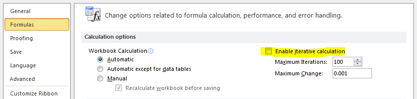

---
title: 'Spreadsheets: the original live coding environment. 
Lessons learnt and steps forward.'
author:
  - name: Felienne Hermans
    affiliation: Delft University of Technology
    email: f.f.j.hermans@tudelft.nl
  - name: Tijs van der Storm
    affiliation: Centrum voor Wiskunde en Informatica
    email: storm@cwi.nl
abstract: |
  Replace this text with a 100-250 word abstract. You'll find it in the
  'metadata block' at the top of your markdown document), be sure that
  each line of the abstract is indented.
fontsize: 11pt
geometry: margin=2cm
fontfamily: libertine
fontfamily: inconsolata
mainfont: Linux Libertine O
monofont: Inconsolata
bibliography: references.bib
...

# Introduction

Spreadsheet systems can easily be considered the most successful form of programming. Winston [@Wins2001] estimates that 90% of all analysts in industry perform calculations in spreadsheets. Spreadsheet users perform a range of diverse tasks with spreadsheets, from inventory administration to educational applications and from scientific modelling to financial systems. The financial business is a domain where spreadsheets are especially prevailing. Panko[@Pank2006] estimates that 95% of U.S. firms, and 80% in Europe, use spreadsheets in some form for financial reporting.

The success of spreadsheets is of course due to many different factors, the ubiquitous Microsoft Office suite within companies provides almost every office worker with a version of Excel, the world's most popular spreadsheet system. However, researchers have also argued that the liveness of spreadsheets has contributed to the widespread success of spreadsheets [@thesisFelienne].

# Live programming in Spreadsheets

Spreadsheets are formally defined as a collection of worksheets, which in turn can contain cells. These cells can contain values, like numbers or text, or formulas, with calculations and cell references. In addition to these basic operations, many spreadsheet systems also allow users to create charts, graphs and pivot tables. When a user enters or updates a formula, the result is immediately shown to the user. Also, all cells depending on the changed formula are updated. 

From interviews with users we know that this _liveness_ is important to users. They often start building a spreadsheet with the end goal in mind, and manipulate the formulas until the obtain the result they want.

# Moving forward

## More power for spreadsheets

### User-defined functions in formula syntax
Despite their widespread success, there are some limitations to spreadsheets. Previous work [@Jone2003] has described the idea of allowing users to add user-defined functions (UDFs) with spreadsheet formula syntax. This seems to be a powerful addition that unfortunately has not made it so common spreadsheet implementations yet. Of course, UDFs can already be implemented with Visual Basic for Applications in Excel, however, this breaks the concept of liveness as the VBA code has to be compiled. Furthermore, also the directness property [@Malo95] is somewhat lost as the VBA code has to be edited in a separate window.

### Loops and fixed points
While it is possible to have spreadsheet systems like Excel calculate fix points, currently, users need to enable special settings to achieve this, as shown in Figure 1. Spreadsheet systems would be more powerful if such features would be expressible with formula syntax rather that with options.

## Spreadsheets properties for regular languages

# Related Work
Related work for this paper comes in different categories, that we will summarize in this section.

## Improving spreadsheets
First of all, there are other papers aiming at improving spreadsheets, for instance by raining the level of abstraction. An example of this is the work of Abraham _et al._ for example, have developed a system called ClassSheets [@Abra2005, Enge2005] with which the design of a spreadsheet can be described. From this specification, spreadsheets can be generated. A related effort is the work of Cunha, which transforms a spreadsheet into a database by analyzing functional dependencies[@Cunh2009]. While evaluations showed that this systems makes users more efficient and effective, the authors also conclude that ``that deeper insight on the spreadsheet models is required to maximize effectiveness''[@Beckw2011]. 

Other directions for improvement have been the by enhancing the interface with units of calculation. Abraham and Erwig for example, have written a series of articles on unit inference[@Abra2004, @Abra2006, @Abra2007}. Their units form a type system based on values in the spreadsheet, which is subsequently used to determine whether all cells in a column or row have the same type, improving the safety of the spreadsheet under test. Ahmad _et al._ [@Ahma2003] also created a system to annotate spreadsheets, however their approach requires users to indicate the types of fields themselves, hence significantly chaining the user experience.

Finally, there are related works that aim to improve spreadsheets by adding various forms of error and 'smell' detection. We ourselves have worked on spreadsheet smells in previous work [@herm2012icse,@hermans2012icsm]. In those papers we have explored both spreadsheet smells at the low level of formulas as in a spreadsheets structure. Recently, other work on spreadsheet smells has been published[@cunh2012] that aims to find smells in values, such as typographical errors and values that do not follow the normal distribution. Related is the recent work by Barowy _et al.__ who created CheckCell, a data debugging tool that finds errors or suspicious values in Excel [@Baro2014].

While all the above directions for improvement have their merits, demonstrated with empirical evidence, they do not specifically focus on retaining or even improving the 'live' properties of spreadsheets like we propose.

## Improving spreadsheets
Another category of related work explores the possibility of transferring live properties, as common in spreadsheets.... 

# Conclusion
This paper describes the liveness properties of spreadsheets and how they contribute to the mainstream success of spreadsheets. In addition, directions are presented to  both move spreadsheets forward and to incorporate the success factors into regular programming languages. as such, the contributions of this paper are as follows:

* An detailed overview of _live_ properties of spreadsheets and their impact on users
* Two distinct directions for the advancement of spreadsheet live programming success:
	1. More power for spreadsheets
	2. Spreadsheets properties for regular languages

# References
